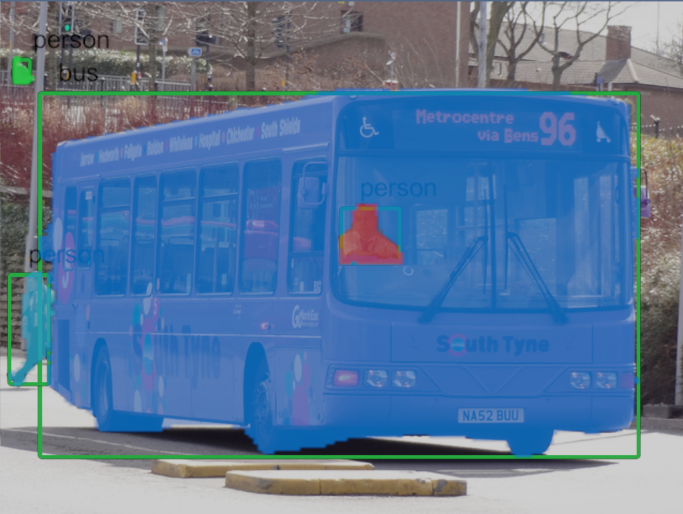

# XR Image Segmentation Sample

This Unity Project demonstrates how to use Unity Inference Engine (previously Sentis) and the YOLO11 model to detect and label object bounding boxes and mask segments in images from the Meta Quest Passthrough Camera.

Much of this code originates from the Unity-PassthroughCameraApiSamples: https://github.com/oculus-samples/Unity-PassthroughCameraApiSamples/tree/main.

## Test Scene

The test scene can run without a headset and uses a selection of images from here:

**Common Objects and Context 2017 Dataset with Yolov8 Annotations**
https://www.kaggle.com/datasets/sarkisshilgevorkyan/coco-dataset-for-yolo 

## XR Scene

The XR scene must be built and deployed to a headset.
